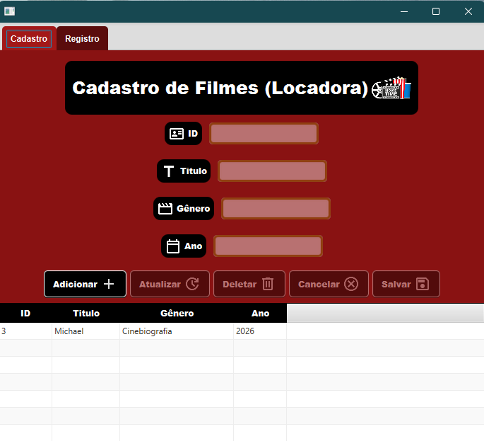

# Projeto CRUD JavaFX com Banco de Dados

<p align="center">
  
</p>

## Título do projeto
Sistema CRUD em JavaFX para cadastro de clientes e filmes.

## Objetivo do projeto
Demonstrar uma interface gráfica em JavaFX que consome repositórios de dados para gerenciar clientes e filmes.

## Versão
0.1

## Autor
marceloakira

## Estrutura principal do projeto
- `controller/` - classes de controle e classe principal de execução
- `model/` - classes de modelo e repositórios de dados
- `view/` - arquivos FXML, CSS e classe JavaFX para a interface

## Como executar no BlueJ
1. Abra o BlueJ.
2. Selecione `Project -> Open Project...` e abra a pasta do projeto:
   `ex11JavaFxBancodeDados`.
3. Compile todos os arquivos:
   - Use `Project -> Compile Project` ou compile os pacotes individualmente.
4. Execute a aplicação JavaFX:
   - Clique com o botão direito em `AppView` dentro do pacote `view`.
   - Selecione `Run as JavaFX Application` (ou equivalente) para iniciar a aplicação.

> Observação: a interface JavaFX carrega o arquivo `view/app.fxml` em tempo de execução. Certifique-se de que o projeto esteja aberto como um projeto BlueJ completo, para que o caminho relativo `view/app.fxml` funcione corretamente.

## Requisitos
- JDK com suporte a JavaFX instalado.
- BlueJ configurado para usar o JDK correto.

## Execução alternativa pelo terminal (fora do BlueJ)
1. Abra um terminal na pasta do projeto.
2. Compile os arquivos Java:
   ```
   javac controller\AppController.java view\AppView.java view\*.java model\*.java
   ```
3. Execute a aplicação:
   ```
   java controller.AppController
   ```

## Instruções para o usuário
- A aplicação abrirá uma janela gráfica com abas para `Cliente` e `Filme`.
- Use os botões e campos da interface para cadastrar, alterar ou remover dados.
- Verifique o console do BlueJ para mensagens de erro caso o FXML não seja encontrado ou o JavaFX não esteja configurado.
